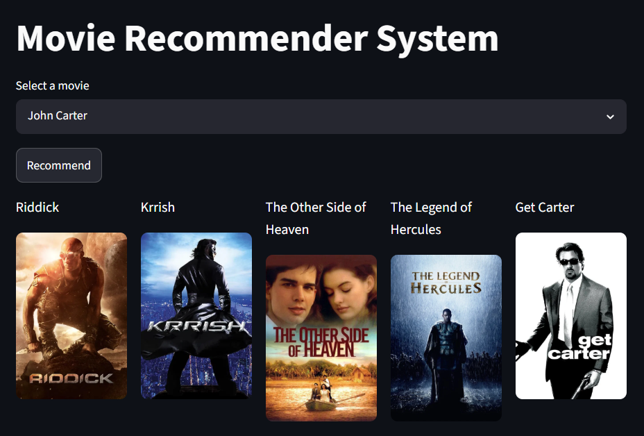

# 🎬 Movie Recommender System

A content-based movie recommendation system built using **Python**, **Streamlit**, and **Scikit-learn**.

## 🚀 Features

- Recommend top 5 similar movies
- Display movie posters using TMDB API
- Interactive Streamlit interface
- Content-based recommendation using cosine similarity

## 🛠️ Tech Stack

- Python
- Streamlit
- Pandas
- Scikit-learn
- Requests
- TMDB API

## Installation

```bash
git clone https://github.com/Surbhisah07/movie-recommender-system.git
cd movie-recommender-system
pip install -r requirements.txt
streamlit run app.py
```
## 📸 Screenshots

### 🏠 Home Page


### 🎬 Movie Recommendations


## Future Improvements

- Add IMDb ratings
- Genre-based recommendations
- User authentication
- Hybrid recommendation system

## Author

**Surbhi Kumari Sah**